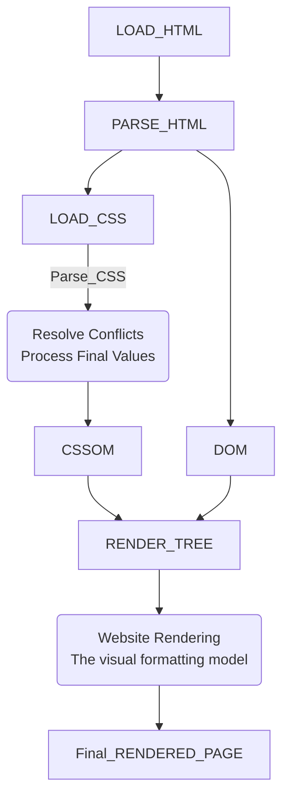

__Cascade:__ Process of combining different stylesheets and resolving conflicts between multiple CSS rules and declarations if there are multiple rules applying to the same element.

__* CSS comes from 3 different sources, Author (developer), User (devtools) and Browser (default CSS declarations from browser, "user agent")__

### Priority on Cascade

#### #1 Priority: IMPORTANCE

* User `!important` declarations - Bad practice
* Author `!important` declarations - Bad practice
* Author declarations
* User declarations
* Default browser declarations

#### #2 Priority: SPECIFICITY

If all have same importance:

* Inline styles
* IDs
* Classes, pseudo-classes, attributes
* Elements, pseudo-elements
* Universal selector `*` has no specificity value.

#### #3 Priority: SOURCE ORDER

* If all have same importance and same specificity, the last declaration overrides all the other declarations.

### About Inheritance

* Inheritance passes the values for some specific properties from parents to childeren
* Properties related to text are inherited: `font-family`,`font-size`,`color` etc.
* The computed value of a property is what gets inherited, not the declared value
* The `inherit` keyword forces inheritance on a certain property
* The `initial` keyword resets a property to its initial value.